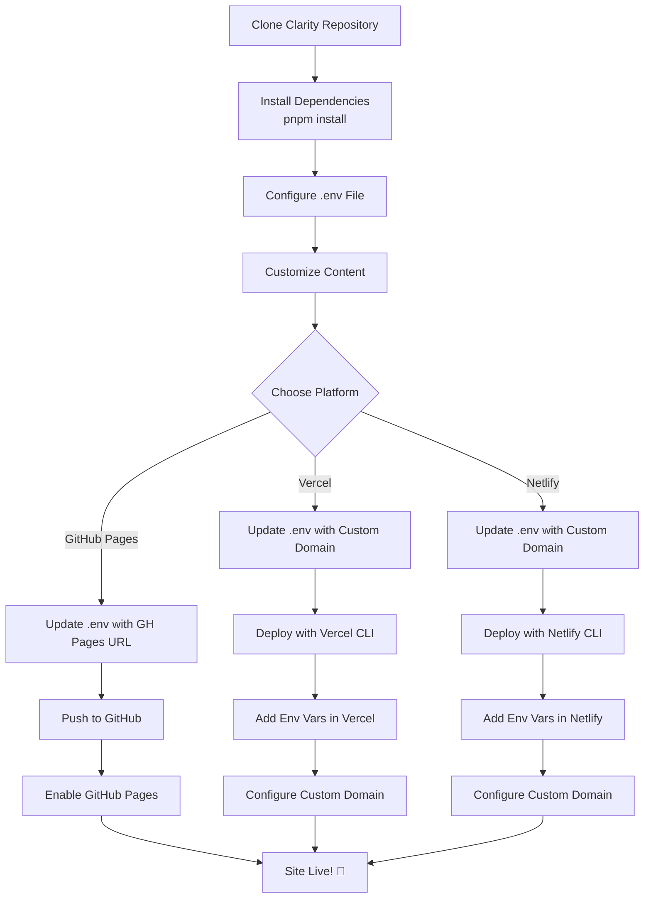

# Deploying Clarity to Your Own Domain

A complete guide to customizing and deploying your own Clarity documentation site. This tutorial walks you through cloning the repository, configuring it for your needs, and deploying to production.

## 📋 Prerequisites

- Node.js 18+ installed
- pnpm installed (`npm install -g pnpm`)
- Git installed
- A GitHub account
- Your deployment platform account (GitHub Pages, Vercel, Netlify, etc.)

## 🚀 Quick Start Tutorial

### Step 1: Clone the Repository

```bash
# Clone Clarity to your local machine
git clone https://github.com/alex-migwi/clarity.git my-docs

# Navigate into the directory
cd my-docs

# Install dependencies
pnpm install
```

### Step 2: Configure Your Environment

Clarity uses environment variables for easy configuration. All settings are in one place!

```bash
# Copy the example environment file
cp .env.example .env
```

Now open `.env` in your editor and customize the values:

```env
# Site Configuration
PUBLIC_SITE_NAME=My Documentation        # ← Your site name
PUBLIC_SITE_DESCRIPTION=Documentation for my awesome project
PUBLIC_SITE_URL=https://docs.mycompany.com  # ← Your production URL
PUBLIC_BASE_PATH=/                       # ← / for root, or /docs/ for subdirectory

# Backend Configuration (optional, for authentication features)
PUBLIC_BACKEND_URL=https://api.mycompany.com

# GitHub Integration
PUBLIC_GITHUB_REPO=myusername/my-repo   # ← Your GitHub repo
PUBLIC_GITHUB_BRANCH=main
PUBLIC_GITHUB_DOCS_PATH=src/content/docs
```

**💡 Tip**: Don't commit `.env` to Git! It's already in `.gitignore` for safety.

### Step 3: Test Locally

```bash
# Start the development server
pnpm dev
```

Visit `http://localhost:4321` to see your site. Changes auto-reload!

### Step 4: Customize Your Content

#### Add Your Logo

Replace these files in the `public/` folder:
- `public/logo.svg` - Your logo (40x40px recommended)
- `public/favicon.svg` - Browser tab icon (128x128px)

#### Write Your Docs

Add markdown files to `src/content/docs/`:

```markdown
---
title: "Getting Started"
description: "Learn how to use my product"
order: 1
---

# Getting Started

Your content here...
```

#### Update Site Colors (Optional)

Edit `src/styles/global.css` to customize your theme colors:

```css
:root {
  --primary: 220 70% 50%;  /* Change to your brand color */
}
```

### Step 5: Deploy to Production

Choose your deployment platform:

#### Option A: GitHub Pages

Perfect for free hosting at `username.github.io/repo-name`

1. **Update your .env for GitHub Pages:**

```env
PUBLIC_SITE_URL=https://yourusername.github.io/your-repo-name
PUBLIC_BASE_PATH=/your-repo-name/
PUBLIC_GITHUB_REPO=yourusername/your-repo-name
```

2. **Create GitHub repository:**

```bash
# Initialize git (if not already done)
git init
git add .
git commit -m "Initial commit"

# Create new repo on GitHub, then:
git remote add origin https://github.com/yourusername/your-repo-name.git
git push -u origin main
```

3. **Set up GitHub Actions** (already configured in `.github/workflows/deploy.yml`)

   - Go to your repo → Settings → Secrets → Actions
   - Add secret: `GITHUB_TOKEN` (automatically provided by GitHub)

4. **Enable GitHub Pages:**
   - Go to Settings → Pages
   - Source: GitHub Actions
   - Your site will be live at `https://yourusername.github.io/your-repo-name/`

#### Option B: Vercel (Recommended for Custom Domains)

Perfect for custom domains like `docs.mycompany.com`

1. **Update your .env for custom domain:**

```env
PUBLIC_SITE_URL=https://docs.mycompany.com
PUBLIC_BASE_PATH=/
PUBLIC_GITHUB_REPO=yourusername/your-repo-name
```

2. **Deploy to Vercel:**

```bash
# Install Vercel CLI
npm i -g vercel

# Login and deploy
vercel
```

3. **Add environment variables in Vercel:**
   - Go to your project → Settings → Environment Variables
   - Add each `PUBLIC_*` variable from your `.env` file
   - Redeploy: `vercel --prod`

4. **Add custom domain:**
   - Project Settings → Domains
   - Add your domain and follow DNS instructions

#### Option C: Netlify

Similar to Vercel, great for custom domains

1. **Update your .env:**

```env
PUBLIC_SITE_URL=https://docs.mycompany.com
PUBLIC_BASE_PATH=/
```

2. **Create `netlify.toml`:**

```toml
[build]
  command = "pnpm build"
  publish = "dist"

[[redirects]]
  from = "/*"
  to = "/404.html"
  status = 404
```

3. **Deploy:**

```bash
# Install Netlify CLI
npm i -g netlify-cli

# Login and deploy
netlify deploy --prod
```

4. **Add environment variables:**
   - Site Settings → Environment Variables
   - Add your `PUBLIC_*` variables

### Step 6: Set Up Authentication (Optional)

If you want to protect your docs with login:

1. **Set up backend:**

```bash
cd backend
cp .env.example .env
# Edit backend/.env with OAuth credentials
npm install
npm start
```

2. **Get OAuth credentials:**
   - Google: [Google Cloud Console](https://console.cloud.google.com)
   - GitHub: [GitHub Developer Settings](https://github.com/settings/developers)

3. **Update backend URL in your main .env:**

```env
PUBLIC_BACKEND_URL=https://your-backend-url.com
```

4. **Enable login in `clarity.config.ts`:**

```typescript
navigation: {
  showLogin: true,
  loginUrl: "/login",
}
```

## 📊 Visual Deployment Flow



## 🔄 Making Updates

After deploying, you can update your docs anytime:

```bash
# 1. Make your changes
# Edit markdown files in src/content/docs/

# 2. Test locally
pnpm dev

# 3. Build to verify
pnpm build

# 4. Commit and push
git add .
git commit -m "Update documentation"
git push

# GitHub Pages: Auto-deploys via Actions
# Vercel/Netlify: Auto-deploys on push (if connected to Git)
```

## 🎯 Common Scenarios

### Scenario 1: Fork for Your Company

You want to use Clarity for internal documentation at `docs.mycompany.com`

**Configuration:**
```env
PUBLIC_SITE_NAME=MyCompany Docs
PUBLIC_SITE_DESCRIPTION=Internal documentation and guides
PUBLIC_SITE_URL=https://docs.mycompany.com
PUBLIC_BASE_PATH=/
PUBLIC_GITHUB_REPO=mycompany/internal-docs
```

**Deployment**: Vercel or Netlify with custom domain

### Scenario 2: Open Source Project Docs

You want docs at `yourproject.github.io` for your OSS project

**Configuration:**
```env
PUBLIC_SITE_NAME=YourProject
PUBLIC_SITE_DESCRIPTION=Documentation for YourProject
PUBLIC_SITE_URL=https://yourproject.github.io
PUBLIC_BASE_PATH=/
PUBLIC_GITHUB_REPO=yourusername/yourproject
```

**Deployment**: GitHub Pages from project repo

### Scenario 3: Multi-Project Documentation Hub

You want all projects under `docs.company.com/project-name`

**Configuration:**
```env
PUBLIC_SITE_NAME=ProjectName Docs
PUBLIC_SITE_URL=https://docs.company.com
PUBLIC_BASE_PATH=/project-name/
PUBLIC_GITHUB_REPO=company/project-name
```

**Deployment**: Vercel with subpath routing

**Deployment**: Vercel with subpath routing

## 📚 Environment Variables Reference

### Site Configuration

| Variable | Description | Example | Required |
|----------|-------------|---------|----------|
| `PUBLIC_SITE_NAME` | Your documentation site name | `Clarity` | Yes |
| `PUBLIC_SITE_DESCRIPTION` | Site description for SEO | `A premium documentation platform` | Yes |
| `PUBLIC_SITE_URL` | Full URL where site is deployed | `https://docs.mycompany.com` | Yes |
| `PUBLIC_BASE_PATH` | Base path for deployment | `/` or `/docs/` | Yes |

### Backend Configuration

| Variable | Description | Example | Required |
|----------|-------------|---------|----------|
| `PUBLIC_BACKEND_URL` | Backend server URL for authentication | `http://localhost:3000` | Optional* |

\* Only required if you enable authentication features

### GitHub Integration

| Variable | Description | Example | Required |
|----------|-------------|---------|----------|
| `PUBLIC_GITHUB_REPO` | GitHub repository (owner/repo) | `myusername/my-repo` | Yes |
| `PUBLIC_GITHUB_BRANCH` | Default branch for edit links | `main` | Yes |
| `PUBLIC_GITHUB_DOCS_PATH` | Path to docs folder in repo | `src/content/docs` | Yes |

## 🛠️ Troubleshooting

### Issue: Logo not loading

**Problem**: Logo shows broken image icon

**Solution**: 
1. Check that `logo.svg` exists in `public/` folder
2. Clear browser cache
3. Verify `PUBLIC_BASE_PATH` is correct in `.env`

### Issue: Links not working (404 errors)

**Problem**: Internal links lead to 404 pages

**Solution**:
1. Check `PUBLIC_BASE_PATH` matches your deployment
2. For GitHub Pages: Must be `/repo-name/`
3. For custom domains: Usually just `/`
4. Rebuild: `pnpm build`

### Issue: Dark mode not working

**Problem**: Theme toggle doesn't work or colors are wrong

**Solution**:
1. Clear browser localStorage
2. Check console for JavaScript errors
3. Verify `global.css` hasn't been modified incorrectly

### Issue: Search not working

**Problem**: Search returns no results

**Solution**:
1. Rebuild to regenerate search index: `pnpm build`
2. Check that markdown files are in `src/content/docs/`
3. Verify frontmatter is valid in all docs

### Issue: Build fails

**Problem**: `pnpm build` shows errors

**Solution**:
1. Check all markdown files have valid frontmatter
2. Run `pnpm install` to ensure dependencies are current
3. Check for TypeScript errors: `pnpm astro check`
4. Review build logs for specific error messages

## 💡 Pro Tips

1. **Use different .env files for different environments:**
   ```bash
   # Development
   .env.development
   
   # Production
   .env.production
   ```

2. **Test builds before deploying:**
   ```bash
   pnpm build
   pnpm preview  # Preview the built site
   ```

3. **Keep .env.example updated:**
   When you add new env variables, update `.env.example` so others know what's needed

4. **Use CI/CD environment variables:**
   In GitHub Actions, Vercel, or Netlify, set env vars in the platform UI instead of committing them

5. **Version your config changes:**
   When updating `clarity.config.ts`, document changes in commit messages

## 🔗 Additional Resources

- [Astro Documentation](https://docs.astro.build)
- [GitHub Pages Guide](https://pages.github.com/)
- [Vercel Deployment](https://vercel.com/docs)
- [Netlify Documentation](https://docs.netlify.com/)
- [Markdown Guide](https://www.markdownguide.org/)

## 🤝 Getting Help

- 📖 [Read the full Clarity docs](https://alex-migwi.github.io/clarity-docs)
- 💬 [Open a discussion](https://github.com/alex-migwi/clarity/discussions)
- 🐛 [Report bugs](https://github.com/alex-migwi/clarity/issues)

## 📄 Files Modified by Environment Variables

This list helps you understand which files are affected when you change environment variables:

### Configuration Files
- `clarity.config.ts` - Main site configuration (name, description, URL, GitHub settings)
- `astro.config.mjs` - Astro build settings (site URL, base path)

### Components  
- `src/components/Header.astro` - Site name in header
- `src/components/Footer.astro` - Footer links and copyright

### Pages
- `src/pages/index.astro` - Landing page content
- `src/pages/login.astro` - Login page (backend URL)
- `src/pages/dashboard.astro` - Dashboard (backend URL)
- `src/layouts/DocLayout.astro` - Documentation page layout

All these files automatically pick up changes from your `.env` file - no manual editing required! 🎉
