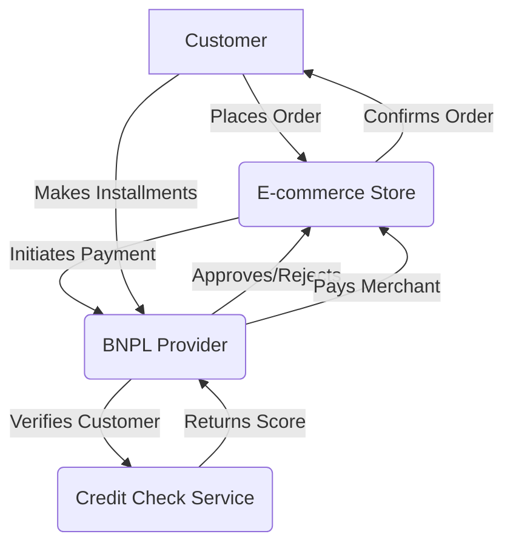

## Buy Now, Pay Later (BNPL) Application

This document provides an overview of the BNPL application, its architecture, and key processes.

### High-Level Architecture

The following diagram illustrates the high-level architecture of the BNPL application.

### Key Processes

- **Customer Onboarding**: New customers are registered and their creditworthiness is assessed.
- **Loan Origination**: When a customer makes a purchase, a new loan is created.
- **Payment Processing**: Installment payments are collected from the customer.
- **Merchant Settlement**: The e-commerce merchant is paid for the purchase.
