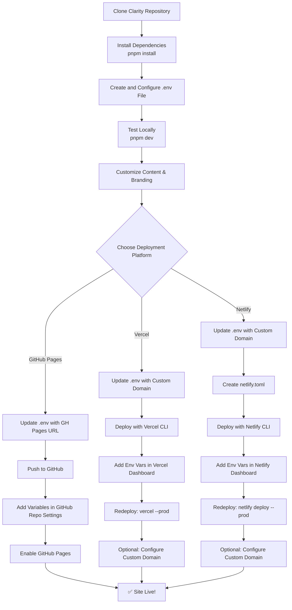

# Deploying Clarity to Your Own Domain

This complete guide walks you through cloning Clarity, customizing it for your needs, and deploying to production. Whether you want free hosting on GitHub Pages or a custom domain on Vercel/Netlify, we've got you covered.

## Prerequisites

Before you begin, ensure you have:

- **Node.js 18+** installed ([download](https://nodejs.org))
- **pnpm** installed (`npm install -g pnpm`)
- **Git** installed ([download](https://git-scm.com))
- A **GitHub account** ([sign up](https://github.com))
- Your deployment platform account (GitHub, Vercel, or Netlify)

## Understanding Environment Variables

Clarity uses environment variables for all configuration. This means:

✅ **One place to configure everything** (site name, URLs, GitHub repo, etc.)  
✅ **Easy to fork and customize** without editing code  
✅ **Secure** - your `.env` file is never pushed to Git  
✅ **Platform-agnostic** - works the same locally, on GitHub Actions, Vercel, Netlify, etc.

### How It Works

**Local Development:**
- You create a `.env` file in your project root
- When you run `pnpm dev` or `pnpm build`, Astro reads this file
- Values are injected into your code via `import.meta.env.PUBLIC_*`

**CI/CD Deployment:**
- **GitHub Actions**: Reads from repository Variables (Settings → Actions → Variables)
- **Vercel**: Reads from project Environment Variables (Settings → Environment Variables)
- **Netlify**: Reads from site Environment Variables (Site Settings → Environment Variables)

**Important**: Your `.env` file is gitignored and **never** pushed to GitHub. Each platform has its own way to set environment variables securely.

## Step-by-Step Tutorial

### Step 1: Clone the Repository

Open your terminal and run:

```bash
# Clone Clarity to your local machine
git clone https://github.com/alex-migwi/clarity.git my-docs

# Navigate into the directory
cd my-docs

# Install dependencies
pnpm install
```

### Step 2: Configure Environment Variables

Copy the example environment file:

```bash
cp .env.example .env
```

Open `.env` in your editor and customize these values:

```env
# === SITE CONFIGURATION ===
# The name of your documentation site (appears in header, titles, etc.)
PUBLIC_SITE_NAME=My Documentation

# Site description for SEO and meta tags
PUBLIC_SITE_DESCRIPTION=Documentation for my awesome project

# Full URL where your site will be deployed
# Examples:
#   - GitHub Pages: https://yourusername.github.io/repo-name
#   - Custom domain: https://docs.mycompany.com
PUBLIC_SITE_URL=https://docs.mycompany.com

# Base path for your site (important for routing)
# Examples:
#   - Root domain: /
#   - Subdirectory: /docs/
#   - GitHub Pages: /repo-name/
PUBLIC_BASE_PATH=/

# === BACKEND CONFIGURATION (Optional) ===
# URL of your authentication backend server
# Only needed if you enable login/auth features
PUBLIC_BACKEND_URL=http://localhost:3000

# === GITHUB INTEGRATION ===
# Your GitHub repository (format: username/repo-name)
PUBLIC_GITHUB_REPO=myusername/my-repo

# Branch name for "Edit on GitHub" links
PUBLIC_GITHUB_BRANCH=main

# Path to docs folder within your repo
PUBLIC_GITHUB_DOCS_PATH=src/content/docs
```

**💡 Important Notes:**

- The `.env` file is already in `.gitignore` - it's safe and won't be pushed to GitHub
- All variables starting with `PUBLIC_` are accessible in your code
- Change these values to match your project - don't use the defaults!

### Step 3: Test Locally

Start the development server to preview your changes:

```bash
pnpm dev
```

Visit **http://localhost:4321** in your browser. You should see Clarity running with your custom configuration!

**✨ What to check:**
- Header shows your `PUBLIC_SITE_NAME`
- Logo loads correctly
- "Edit on GitHub" links point to your `PUBLIC_GITHUB_REPO`
- All navigation works

### Step 4: Customize Content

Now make Clarity truly yours!

#### Replace the Logo

1. Create your logo as an SVG file (recommended: 40×40px)
2. Save it as `public/logo.svg` (replace the existing file)
3. Optional: Update `public/favicon.svg` for the browser tab icon

#### Write Your Documentation

Add markdown files to `src/content/docs/`:

```markdown
---
title: "Getting Started"
description: "Learn how to use my product"
order: 1
---

# Getting Started

Welcome to my documentation! Here's how to get started...

## Installation

```bash
npm install my-package
```

## Usage

...
```

**📝 Frontmatter Fields:**
- `title` - Page title (required)
- `description` - SEO description (required)
- `order` - Sidebar ordering (optional)

#### Customize Theme Colors (Optional)

Edit `src/styles/global.css` to change colors:

```css
:root {
  /* Primary brand color */
  --primary: 220 70% 50%;  /* Change to your brand color */
  
  /* Background colors */
  --background: 0 0% 100%;
  --foreground: 0 0% 5%;
}
```

Use HSL values for best results (format: `hue saturation lightness`).

### Step 5: Choose Your Deployment Platform

Now it's time to deploy! Choose the platform that fits your needs:

| Platform | Best For | Custom Domain | Cost |
|----------|----------|---------------|------|
| **GitHub Pages** | Free hosting for open source | Yes (with setup) | Free |
| **Vercel** | Professional sites, fastest setup | Yes (easy) | Free tier available |
| **Netlify** | Great DX, form handling | Yes (easy) | Free tier available |

## Deployment Options

### Option A: GitHub Pages

**Perfect for:** Open source projects, free hosting at `username.github.io/repo-name`

#### 1. Update Environment Variables for GitHub Pages

Edit your `.env` file:

```env
PUBLIC_SITE_URL=https://yourusername.github.io/your-repo-name
PUBLIC_BASE_PATH=/your-repo-name/
PUBLIC_GITHUB_REPO=yourusername/your-repo-name
```

**⚠️ Important:** The `PUBLIC_BASE_PATH` must match your repository name!

#### 2. Create GitHub Repository

```bash
# Initialize git (if not already done)
git init
git add .
git commit -m "Initial commit: Clarity documentation"

# Create a new repo on GitHub, then add it as remote
git remote add origin https://github.com/yourusername/your-repo-name.git
git push -u origin main
```

#### 3. Configure GitHub Actions

The deployment workflow is already set up in `.github/workflows/docs-deploy.yml`, but it needs environment variables.

Go to your GitHub repository → **Settings** → **Secrets and variables** → **Actions** → **Variables** tab

Click **"New repository variable"** and add each one:

| Variable Name | Your Value |
|---------------|------------|
| `PUBLIC_SITE_NAME` | Your site name (e.g., "My Docs") |
| `PUBLIC_SITE_DESCRIPTION` | Your site description |
| `PUBLIC_SITE_URL` | `https://yourusername.github.io/your-repo-name` |
| `PUBLIC_BASE_PATH` | `/your-repo-name/` |
| `PUBLIC_GITHUB_REPO` | `yourusername/your-repo-name` |
| `PUBLIC_GITHUB_BRANCH` | `main` |
| `PUBLIC_GITHUB_DOCS_PATH` | `src/content/docs` |
| `PUBLIC_BACKEND_URL` | (Optional) Only if using auth features |

**💡 Note:** You don't need to set `GITHUB_TOKEN` - it's automatically provided by GitHub Actions.

#### 4. Enable GitHub Pages

1. Go to your repo → **Settings** → **Pages**
2. Under "Source", select **GitHub Actions**
3. Save

That's it! GitHub Actions will automatically build and deploy your site when you push to `main`.

**🎉 Your site will be live at:** `https://yourusername.github.io/your-repo-name/`

#### 5. Verify Deployment

Wait 1-2 minutes for the build to complete, then:

1. Go to **Actions** tab in your repo
2. Check the latest workflow run - it should be green ✅
3. Visit your site URL

### Option B: Vercel

**Perfect for:** Professional sites, custom domains, fastest builds

#### 1. Update Environment Variables for Vercel

Edit your `.env` file:

```env
PUBLIC_SITE_URL=https://docs.mycompany.com
PUBLIC_BASE_PATH=/
PUBLIC_GITHUB_REPO=yourusername/your-repo-name
```

**💡 For custom domains:** Use your actual domain. For Vercel's auto domain, use `https://your-project.vercel.app`

#### 2. Deploy to Vercel

Install Vercel CLI and deploy:

```bash
# Install Vercel CLI globally
npm i -g vercel

# Login to Vercel
vercel login

# Deploy (follow the prompts)
vercel
```

During setup:
- **Set up and deploy?** → Yes
- **Which scope?** → Your account
- **Link to existing project?** → No
- **Project name?** → your-docs (or any name)
- **Directory?** → ./ (just press Enter)
- **Override settings?** → No

#### 3. Add Environment Variables in Vercel

**Critical:** Vercel doesn't read your `.env` file! You must add variables in the dashboard.

1. Go to your project on [vercel.com](https://vercel.com)
2. Click **Settings** → **Environment Variables**
3. Add each variable:

| Variable Name | Your Value | Environments |
|---------------|------------|--------------|
| `PUBLIC_SITE_NAME` | Your site name | Production, Preview, Development |
| `PUBLIC_SITE_DESCRIPTION` | Your description | Production, Preview, Development |
| `PUBLIC_SITE_URL` | `https://docs.mycompany.com` | Production, Preview, Development |
| `PUBLIC_BASE_PATH` | `/` | Production, Preview, Development |
| `PUBLIC_GITHUB_REPO` | `yourusername/your-repo-name` | Production, Preview, Development |
| `PUBLIC_GITHUB_BRANCH` | `main` | Production, Preview, Development |
| `PUBLIC_GITHUB_DOCS_PATH` | `src/content/docs` | Production, Preview, Development |

**Important:** Select all three environments (Production, Preview, Development) for each variable!

#### 4. Redeploy with Environment Variables

After adding variables, trigger a new deployment:

```bash
vercel --prod
```

Or click **"Redeploy"** in the Vercel dashboard.

#### 5. Add Custom Domain (Optional)

1. In your project → **Settings** → **Domains**
2. Click **Add Domain**
3. Enter your domain (e.g., `docs.mycompany.com`)
4. Follow the DNS configuration instructions
5. Wait for DNS propagation (5-30 minutes)

**🎉 Your site will be live at:** Your custom domain or `https://your-project.vercel.app`

### Option C: Netlify

**Perfect for:** Great developer experience, form handling, edge functions

#### 1. Update Environment Variables for Netlify

Edit your `.env` file:

```env
PUBLIC_SITE_URL=https://docs.mycompany.com
PUBLIC_BASE_PATH=/
PUBLIC_GITHUB_REPO=yourusername/your-repo-name
```

#### 2. Create netlify.toml

Create a file named `netlify.toml` in your project root:

```toml
[build]
  command = "pnpm build"
  publish = "dist"

[[redirects]]
  from = "/*"
  to = "/404.html"
  status = 404
```

Commit this file:

```bash
git add netlify.toml
git commit -m "Add Netlify configuration"
```

#### 3. Deploy to Netlify

Install Netlify CLI and deploy:

```bash
# Install Netlify CLI globally
npm i -g netlify-cli

# Login to Netlify
netlify login

# Initialize and deploy
netlify init
```

Follow the prompts:
- **Create & configure a new site?** → Yes
- **Team?** → Your team
- **Site name?** → your-docs (or leave blank for random)
- **Build command?** → `pnpm build`
- **Publish directory?** → `dist`

Then deploy to production:

```bash
netlify deploy --prod
```

#### 4. Add Environment Variables in Netlify

**Critical:** Netlify doesn't read your `.env` file! You must add variables in the dashboard.

1. Go to your site on [netlify.com](https://netlify.com)
2. Click **Site settings** → **Environment variables**
3. Click **Add a variable** and add each one:

| Variable Name | Your Value |
|---------------|------------|
| `PUBLIC_SITE_NAME` | Your site name |
| `PUBLIC_SITE_DESCRIPTION` | Your description |
| `PUBLIC_SITE_URL` | `https://docs.mycompany.com` |
| `PUBLIC_BASE_PATH` | `/` |
| `PUBLIC_GITHUB_REPO` | `yourusername/your-repo-name` |
| `PUBLIC_GITHUB_BRANCH` | `main` |
| `PUBLIC_GITHUB_DOCS_PATH` | `src/content/docs` |

#### 5. Trigger Redeploy

After adding variables, trigger a new build:

```bash
netlify deploy --prod
```

Or click **"Trigger deploy"** → **"Deploy site"** in the Netlify dashboard.

#### 6. Add Custom Domain (Optional)

1. In your site → **Domain settings** → **Add custom domain**
2. Enter your domain (e.g., `docs.mycompany.com`)
3. Follow the DNS configuration instructions
4. Netlify automatically provisions SSL certificate

**🎉 Your site will be live at:** Your custom domain or `https://your-site.netlify.app`

## Visual Deployment Flow

Here's how the deployment process works for each platform:



## Making Updates

After your initial deployment, updating your docs is simple:

### 1. Edit Content

Make changes to your markdown files:

```bash
# Add new docs or edit existing ones
vim src/content/docs/my-new-guide.md
```

### 2. Test Locally

Always test before deploying:

```bash
# Start dev server
pnpm dev

# Or build to verify
pnpm build
pnpm preview
```

### 3. Commit and Push

```bash
git add .
git commit -m "Add new guide about XYZ"
git push
```

### 4. Automatic Deployment

Your site automatically redeploys:
- **GitHub Pages**: Via GitHub Actions (1-2 minutes)
- **Vercel**: Automatic on push if connected to Git
- **Netlify**: Automatic on push if connected to Git

**Manual deployment:**
- **Vercel**: `vercel --prod`
- **Netlify**: `netlify deploy --prod`

## Common Deployment Scenarios

### Scenario 1: Company Documentation

**Goal:** Internal docs at `docs.mycompany.com`

**Configuration:**
```env
PUBLIC_SITE_NAME=MyCompany Docs
PUBLIC_SITE_DESCRIPTION=Internal documentation and guides
PUBLIC_SITE_URL=https://docs.mycompany.com
PUBLIC_BASE_PATH=/
PUBLIC_GITHUB_REPO=mycompany/internal-docs
```

**Recommended Platform:** Vercel or Netlify with access control

**Steps:**
1. Configure `.env` as above
2. Deploy to Vercel/Netlify
3. Add custom domain in platform settings
4. Optional: Enable password protection in platform settings

### Scenario 2: Open Source Project

**Goal:** Free docs at `yourproject.github.io`

**Configuration:**
```env
PUBLIC_SITE_NAME=YourProject
PUBLIC_SITE_DESCRIPTION=Documentation for YourProject
PUBLIC_SITE_URL=https://yourproject.github.io
PUBLIC_BASE_PATH=/
PUBLIC_GITHUB_REPO=yourusername/yourproject
```

**Recommended Platform:** GitHub Pages (free!)

**Steps:**
1. Configure `.env` as above (no `/repo-name/` base path)
2. Deploy using the GitHub Pages guide above
3. Use your organization's github.io domain

### Scenario 3: Multi-Project Hub

**Goal:** Multiple projects under `docs.company.com/project-name`

**Configuration:**
```env
PUBLIC_SITE_NAME=ProjectName Docs
PUBLIC_SITE_URL=https://docs.company.com
PUBLIC_BASE_PATH=/project-name/
PUBLIC_GITHUB_REPO=company/project-name
```

**Recommended Platform:** Vercel with path routing

**Steps:**
1. Deploy each project separately to Vercel
2. Configure each with unique base path
3. Set up path-based routing in main domain

### Scenario 4: Staging + Production

**Goal:** Test changes on staging before production

**Configuration:**

Create two `.env` files:

**.env.development:**
```env
PUBLIC_SITE_URL=https://staging-docs.mycompany.com
PUBLIC_BACKEND_URL=https://staging-api.mycompany.com
```

**.env.production:**
```env
PUBLIC_SITE_URL=https://docs.mycompany.com
PUBLIC_BACKEND_URL=https://api.mycompany.com
```

**Steps:**
1. Deploy main branch to production
2. Deploy develop branch to staging
3. Use environment-specific variables in each deployment

## Troubleshooting

### Logo Not Loading

**Problem:** Logo shows broken image icon

**Possible Causes:**
1. Logo file doesn't exist at `public/logo.svg`
2. Wrong base path in `.env`
3. Cache issue

**Solutions:**
```bash
# 1. Check file exists
ls -la public/logo.svg

# 2. Verify base path in .env matches deployment
# For GitHub Pages: PUBLIC_BASE_PATH=/repo-name/
# For custom domain: PUBLIC_BASE_PATH=/

# 3. Clear cache and rebuild
rm -rf dist .astro
pnpm build

# 4. Hard refresh in browser (Ctrl+Shift+R or Cmd+Shift+R)
```

### Links Not Working (404 Errors)

**Problem:** Clicking internal links leads to 404 pages

**Possible Causes:**
1. Wrong `PUBLIC_BASE_PATH`
2. Missing trailing slash
3. Routing not configured

**Solutions:**
```bash
# 1. Check your base path matches deployment
# GitHub Pages subdirectory: /repo-name/
# Root domain: /

# 2. Ensure trailing slash for directories
PUBLIC_BASE_PATH=/docs/  # ← note the trailing slash

# 3. Rebuild
pnpm build

# 4. For Netlify, ensure netlify.toml has redirects
```

### Environment Variables Not Working

**Problem:** Site shows default values instead of your configuration

**Possible Causes:**
1. Variables not set in deployment platform
2. Variable names incorrect (must start with `PUBLIC_`)
3. Deployment not triggered after adding variables

**Solutions:**

**For GitHub Pages:**
```bash
# 1. Check repository variables are set
# Go to Settings → Secrets and variables → Actions → Variables

# 2. Verify workflow file has env: block
cat .github/workflows/docs-deploy.yml

# 3. Trigger new deployment
git commit --allow-empty -m "Trigger rebuild"
git push
```

**For Vercel:**
```bash
# 1. Check environment variables in dashboard
# Settings → Environment Variables

# 2. Ensure all environments are selected
# ✅ Production ✅ Preview ✅ Development

# 3. Redeploy
vercel --prod
```

**For Netlify:**
```bash
# 1. Check site environment variables
# Site settings → Environment variables

# 2. Variables must be set for all contexts
# Deploy contexts: All

# 3. Trigger redeploy
netlify deploy --prod
```

### Build Failing

**Problem:** `pnpm build` shows errors

**Common Errors:**

**1. TypeScript Errors:**
```bash
# Check for errors
pnpm astro check

# Often fixed by rebuilding dependencies
rm -rf node_modules pnpm-lock.yaml
pnpm install
```

**2. Markdown Frontmatter Errors:**
```bash
# Ensure all markdown files have valid frontmatter
---
title: "My Page"
description: "Description here"
---
```

**3. Missing Dependencies:**
```bash
# Reinstall dependencies
pnpm install
```

**4. Tailwind CSS Errors:**
```bash
# If you modified global.css, check syntax
# @apply cannot use custom CSS variables with opacity
# ❌ @apply bg-primary/50
# ✅ background-color: hsl(var(--primary) / 0.5);
```

### Search Not Working

**Problem:** Search returns no results or is missing

**Solutions:**
```bash
# 1. Check if search index was generated
pnpm build | grep "Search index"
# Should see: "✅ Search index generated with X documents!"

# 2. Ensure markdown files are in correct location
ls -la src/content/docs/

# 3. Verify frontmatter has title and description
# Missing titles/descriptions won't be indexed

# 4. Rebuild from scratch
rm -rf dist .astro
pnpm build
```

### Dark Mode Issues

**Problem:** Theme toggle doesn't work or colors are wrong

**Solutions:**
```bash
# 1. Clear browser localStorage
# Open browser console:
localStorage.clear()
location.reload()

# 2. Check console for JavaScript errors
# Open DevTools → Console

# 3. Verify global.css hasn't been modified incorrectly
git diff src/styles/global.css

# 4. Reset to default if needed
git checkout src/styles/global.css
```

### "Edit on GitHub" Links Broken

**Problem:** Edit links go to wrong repo or 404

**Solutions:**
```bash
# 1. Check GitHub configuration in .env
PUBLIC_GITHUB_REPO=yourusername/your-repo  # ← must be correct!
PUBLIC_GITHUB_BRANCH=main  # ← your default branch
PUBLIC_GITHUB_DOCS_PATH=src/content/docs  # ← path to docs

# 2. Verify in deployment platform
# Variables must be set there too!

# 3. Test link format manually
# Should be: https://github.com/{repo}/edit/{branch}/{path}/{file}.md
```

## Environment Variables Reference

Here's a complete reference of all environment variables:

### Site Configuration

| Variable | Description | Example | Required |
|----------|-------------|---------|----------|
| `PUBLIC_SITE_NAME` | Your documentation site name (shown in header, titles, footer) | `Clarity` | ✅ Yes |
| `PUBLIC_SITE_DESCRIPTION` | Site description for SEO meta tags | `A premium documentation platform for teams` | ✅ Yes |
| `PUBLIC_SITE_URL` | Full URL where site is deployed (used for canonical URLs, sitemaps) | `https://docs.mycompany.com` | ✅ Yes |
| `PUBLIC_BASE_PATH` | Base path for deployment (affects routing and asset paths) | `/` or `/docs/` | ✅ Yes |

**💡 Notes:**
- `PUBLIC_SITE_NAME` appears in browser titles, header, footer
- `PUBLIC_SITE_DESCRIPTION` is used in meta tags for SEO
- `PUBLIC_SITE_URL` must be full URL including protocol (https://)
- `PUBLIC_BASE_PATH` must have leading and trailing slash (or just `/` for root)

### Backend Configuration

| Variable | Description | Example | Required |
|----------|-------------|---------|----------|
| `PUBLIC_BACKEND_URL` | Backend server URL for authentication features | `http://localhost:3000` (dev)<br/>`https://api.mycompany.com` (prod) | ⚠️ Optional* |

**💡 Notes:**
- Only needed if you enable authentication/login features
- Use `http://localhost:3000` for local development
- Use your production API URL for deployed sites

### GitHub Integration

| Variable | Description | Example | Required |
|----------|-------------|---------|----------|
| `PUBLIC_GITHUB_REPO` | GitHub repository in format owner/repo-name (used for "Edit on GitHub" links) | `myusername/my-repo` | ✅ Yes |
| `PUBLIC_GITHUB_BRANCH` | Default branch name (used in edit links) | `main` or `master` | ✅ Yes |
| `PUBLIC_GITHUB_DOCS_PATH` | Path to docs folder within repo (where markdown files are) | `src/content/docs` | ✅ Yes |

**💡 Notes:**
- `PUBLIC_GITHUB_REPO` enables "Edit on GitHub" button on doc pages
- `PUBLIC_GITHUB_BRANCH` should be your main/default branch
- `PUBLIC_GITHUB_DOCS_PATH` is relative to repo root

### Where These Variables Are Used

Understanding which files use environment variables helps with debugging:

**Configuration Files:**
- `clarity.config.ts` - Site name, description, URL, GitHub settings
- `astro.config.mjs` - Site URL and base path for build

**Components:**
- `src/components/Header.astro` - Site name in header
- `src/components/Footer.astro` - Site name in footer, GitHub links
- `src/components/EditLink.astro` - "Edit on GitHub" functionality

**Pages:**
- `src/pages/index.astro` - Landing page content
- `src/pages/login.astro` - Backend URL for authentication
- `src/pages/dashboard.astro` - Backend URL for API calls
- `src/layouts/DocLayout.astro` - Page titles, meta tags

**Build:**
- `scripts/generate-search-index.mjs` - Site URL for search metadata

All these files automatically read from environment variables - no manual editing needed! 🎉

## Setting Up Authentication (Optional)

If you want to protect your docs with login:

### 1. Backend Setup

```bash
# Navigate to backend folder
cd backend

# Copy environment template
cp .env.example .env

# Edit backend/.env with your OAuth credentials
```

### 2. Get OAuth Credentials

**For Google OAuth:**
1. Go to [Google Cloud Console](https://console.cloud.google.com)
2. Create a new project
3. Enable Google+ API
4. Create OAuth 2.0 credentials
5. Add authorized redirect URIs

**For GitHub OAuth:**
1. Go to [GitHub Developer Settings](https://github.com/settings/developers)
2. Click "New OAuth App"
3. Fill in application details
4. Note the Client ID and Client Secret

### 3. Configure Backend

Edit `backend/.env`:

```env
# Server
PORT=3000
NODE_ENV=development

# OAuth - Google
GOOGLE_CLIENT_ID=your-google-client-id
GOOGLE_CLIENT_SECRET=your-google-client-secret
GOOGLE_CALLBACK_URL=http://localhost:3000/auth/google/callback

# OAuth - GitHub
GITHUB_CLIENT_ID=your-github-client-id
GITHUB_CLIENT_SECRET=your-github-client-secret
GITHUB_CALLBACK_URL=http://localhost:3000/auth/github/callback

# Session
SESSION_SECRET=your-random-secret-string-here

# Frontend URL
FRONTEND_URL=http://localhost:4321
```

### 4. Start Backend Server

```bash
cd backend
npm install
npm start
```

### 5. Update Frontend Configuration

In your main `.env`:

```env
PUBLIC_BACKEND_URL=http://localhost:3000
```

### 6. Enable Login in Config

Edit `clarity.config.ts`:

```typescript
navigation: {
  showLogin: true,
  loginUrl: "/login",
}
```

### 7. Test Authentication

1. Start frontend: `pnpm dev`
2. Visit `http://localhost:4321`
3. Click "Login" in header
4. Try Google or GitHub login

### 8. Deploy Backend

For production, deploy your backend to:
- **Heroku**: `heroku create && git push heroku main`
- **Railway**: Connect GitHub repo and deploy
- **Render**: Connect GitHub repo and deploy

Update `PUBLIC_BACKEND_URL` in your deployment platform to point to deployed backend.

## Best Practices

### 1. Keep .env.example Updated

When you add new environment variables, update `.env.example`:

```bash
# Add new variable to .env
echo "PUBLIC_NEW_SETTING=value" >> .env

# Document it in .env.example
echo "PUBLIC_NEW_SETTING=default-value  # Description" >> .env.example

# Commit .env.example (but NOT .env!)
git add .env.example
git commit -m "Add new environment variable"
```

### 2. Test Builds Before Deploying

Always test production builds locally:

```bash
# Build for production
pnpm build

# Preview the built site
pnpm preview

# Check for errors
pnpm astro check
```

### 3. Use Different Values Per Environment

Create environment-specific files:

```bash
# Development
.env.development

# Staging
.env.staging

# Production
.env.production
```

### 4. Document Configuration Changes

When updating config, add clear commit messages:

```bash
git commit -m "Update site name to Company Docs"
git commit -m "Change base path for subdirectory deployment"
```

### 5. Secure Your Secrets

**Never commit:**
- `.env` file
- API keys
- OAuth secrets
- Database credentials

**Always use:**
- Platform environment variables (GitHub, Vercel, Netlify)
- Secret management tools
- `.gitignore` for sensitive files

### 6. Monitor Your Deployments

Set up monitoring:
- **GitHub Pages**: Check Actions tab for build status
- **Vercel**: Enable deployment notifications
- **Netlify**: Set up deploy notifications

### 7. Regular Updates

Keep Clarity and dependencies updated:

```bash
# Update dependencies
pnpm update

# Check for outdated packages
pnpm outdated

# Update Astro
pnpm add astro@latest
```

## Additional Resources

### Documentation
- 📖 [Astro Documentation](https://docs.astro.build)
- 📖 [Tailwind CSS Documentation](https://tailwindcss.com/docs)
- 📖 [Markdown Guide](https://www.markdownguide.org/)

### Platform Guides
- 🚀 [GitHub Pages Documentation](https://pages.github.com/)
- 🚀 [Vercel Documentation](https://vercel.com/docs)
- 🚀 [Netlify Documentation](https://docs.netlify.com/)

### Community
- 💬 [Clarity GitHub Discussions](https://github.com/alex-migwi/clarity/discussions)
- 🐛 [Report Issues](https://github.com/alex-migwi/clarity/issues)
- ⭐ [Star on GitHub](https://github.com/alex-migwi/clarity)

## Getting Help

If you run into issues:

1. **Check this guide** - Most common issues are covered in Troubleshooting
2. **Search existing issues** - [GitHub Issues](https://github.com/alex-migwi/clarity/issues)
3. **Ask in discussions** - [GitHub Discussions](https://github.com/alex-migwi/clarity/discussions)
4. **Open a new issue** - Provide details about your setup and error messages

## What's Next?

Now that you've deployed Clarity, you can:

- ✍️ [Write great documentation](./sample-guide) using our writing guide
- 🎨 [Use components](./using-components) to enhance your docs
- ⚙️ [Configure features](./configuration) like search, theme, navigation
- 🔒 Set up authentication for private docs
- 📊 Add analytics to track usage
- 🎯 Customize styling to match your brand

Happy documenting! 📚✨
