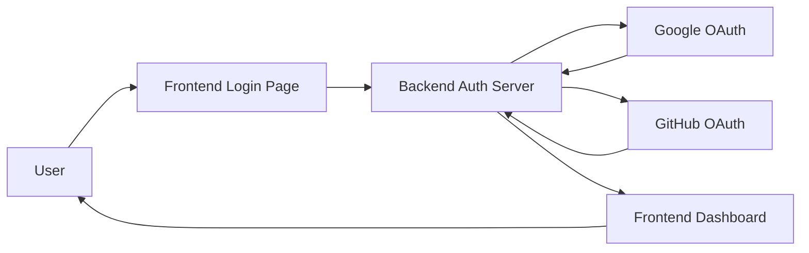

# Authentication Setup Guide

Clarity includes built-in authentication using OAuth 2.0 with Google and GitHub. This guide walks you through setting up authentication for your documentation site.

## Overview

The authentication system consists of:
- **Frontend**: Login page and dashboard built with Astro
- **Backend**: Node.js/Express server handling OAuth flows
- **OAuth Providers**: Google and GitHub for social login

## Prerequisites

Before you begin, you'll need:
- A Google Cloud Console account
- A GitHub account
- Node.js v18 or higher installed
- Basic understanding of OAuth 2.0 flow

## Architecture



## Backend Setup

### Step 1: Install Backend Dependencies

Navigate to the backend folder and install dependencies:

```bash
cd backend
npm install
```

This installs:
- `express` - Web server framework
- `passport` - Authentication middleware
- `passport-google-oauth20` - Google OAuth strategy
- `passport-github` - GitHub OAuth strategy
- `express-session` - Session management
- `cors` - Cross-origin resource sharing
- `dotenv` - Environment variable management

### Step 2: Configure Environment Variables

Create a `backend/.env` file with the following variables:

```bash
# Session Configuration
SESSION_SECRET=your-random-secret-min-32-characters-long

# Google OAuth
GOOGLE_CLIENT_ID=your-google-oauth-client-id
GOOGLE_CLIENT_SECRET=your-google-oauth-client-secret

# GitHub OAuth
GITHUB_CLIENT_ID=your-github-oauth-client-id
GITHUB_CLIENT_SECRET=your-github-oauth-client-secret

# Server Configuration
NODE_ENV=development
PORT=3000
FRONTEND_URL=http://localhost:4321
```

**Important Security Notes**:
- Never commit `.env` files to version control
- Use a strong random string for `SESSION_SECRET` (minimum 32 characters)
- Keep your OAuth secrets secure
- Use different credentials for development and production

### Step 3: Generate Session Secret

Generate a secure session secret:

```bash
# Using Node.js
node -e "console.log(require('crypto').randomBytes(32).toString('hex'))"

# Using OpenSSL
openssl rand -hex 32
```

Copy the output to `SESSION_SECRET` in your `.env` file.

## Google OAuth Setup

### Step 1: Create Google Cloud Project

1. Go to [Google Cloud Console](https://console.cloud.google.com)
2. Click **Select a project** → **New Project**
3. Enter a project name (e.g., "Clarity Docs")
4. Click **Create**

### Step 2: Configure OAuth Consent Screen

1. Navigate to **APIs & Services** → **OAuth consent screen**
2. Select **External** user type (unless you have Google Workspace)
3. Click **Create**
4. Fill in required information:
   - **App name**: Your documentation site name
   - **User support email**: Your email
   - **Developer contact information**: Your email
5. Click **Save and Continue**
6. Skip adding scopes (default scopes are sufficient)
7. Add test users if needed during development
8. Click **Save and Continue**

### Step 3: Create OAuth Credentials

1. Navigate to **APIs & Services** → **Credentials**
2. Click **Create Credentials** → **OAuth 2.0 Client ID**
3. Select **Web application** as application type
4. Enter a name (e.g., "Clarity Auth")
5. Add **Authorized JavaScript origins**:
   ```
   http://localhost:3000
   ```
6. Add **Authorized redirect URIs**:
   ```
   http://localhost:3000/auth/google/callback
   ```
7. Click **Create**
8. Copy the **Client ID** and **Client Secret**
9. Add them to `backend/.env`:
   ```bash
   GOOGLE_CLIENT_ID=your-client-id.apps.googleusercontent.com
   GOOGLE_CLIENT_SECRET=your-client-secret
   ```

### Production Configuration

When deploying to production, add production URLs:

**Authorized JavaScript origins**:
```
https://your-backend-domain.com
```

**Authorized redirect URIs**:
```
https://your-backend-domain.com/auth/google/callback
```

## GitHub OAuth Setup

### Step 1: Create OAuth Application

1. Go to [GitHub Settings](https://github.com/settings/developers)
2. Click **Developer settings** in the left sidebar
3. Click **OAuth Apps** → **New OAuth App**
4. Fill in the application details:
   - **Application name**: Your documentation site name
   - **Homepage URL**: `http://localhost:4321` (development)
   - **Application description**: Optional description
   - **Authorization callback URL**: `http://localhost:3000/auth/github/callback`
5. Click **Register application**

### Step 2: Generate Client Secret

1. After registration, you'll see the **Client ID**
2. Click **Generate a new client secret**
3. Copy the client secret immediately (you can't view it again)
4. Add both to `backend/.env`:
   ```bash
   GITHUB_CLIENT_ID=your-github-client-id
   GITHUB_CLIENT_SECRET=your-github-client-secret
   ```

### Production Configuration

When deploying to production, update your OAuth App:

1. Go to your OAuth App settings
2. Update **Homepage URL**: `https://your-domain.com`
3. Update **Authorization callback URL**: `https://your-backend-domain.com/auth/github/callback`
4. Click **Update application**

## Testing Authentication Locally

### Step 1: Start the Backend Server

Open a terminal and start the backend:

```bash
cd backend
npm start
```

You should see:
```
Backend server running on http://localhost:3000
```

### Step 2: Start the Frontend

Open another terminal and start the Astro dev server:

```bash
pnpm dev
```

Visit `http://localhost:4321`

### Step 3: Test Login Flow

1. Navigate to `http://localhost:4321/login`
2. Click **Login with Google** or **Login with GitHub**
3. Complete the OAuth authorization
4. You should be redirected to the dashboard at `/dashboard`

### Troubleshooting Local Testing

**Issue**: "Redirect URI mismatch"

**Solution**: Ensure your OAuth callback URLs exactly match:
- Google: `http://localhost:3000/auth/google/callback`
- GitHub: `http://localhost:3000/auth/github/callback`

**Issue**: CORS errors in browser console

**Solution**: Verify `FRONTEND_URL` in `backend/.env` is set to `http://localhost:4321`

**Issue**: "Cannot GET /auth/user"

**Solution**: Make sure the backend server is running on port 3000

## Authentication Endpoints

The backend provides these endpoints:

| Endpoint | Method | Description |
|----------|--------|-------------|
| `/auth/google` | GET | Initiate Google OAuth flow |
| `/auth/google/callback` | GET | Google OAuth callback |
| `/auth/github` | GET | Initiate GitHub OAuth flow |
| `/auth/github/callback` | GET | GitHub OAuth callback |
| `/auth/user` | GET | Get current user info |
| `/auth/logout` | GET | Logout and clear session |

## Frontend Integration

### Login Page

The login page is at `src/pages/login.astro`:

```astro
---
const backendUrl = 'http://localhost:3000';
---

<a href={`${backendUrl}/auth/google`}>
  Login with Google
</a>

<a href={`${backendUrl}/auth/github`}>
  Login with GitHub
</a>
```

### Protected Dashboard

The dashboard at `src/pages/dashboard.astro` can be protected by checking authentication status:

```astro
---
// Check if user is authenticated
const response = await fetch('http://localhost:3000/auth/user', {
  credentials: 'include'
});

if (!response.ok) {
  return Astro.redirect('/login');
}

const user = await response.json();
---

<h1>Welcome, {user.displayName}!</h1>
```

## Disabling Authentication

If you don't need authentication, you can disable it:

1. Update `clarity.config.ts`:
   ```typescript
   navigation: {
     showLogin: false, // Hide login button
   }
   ```

2. Delete or ignore the backend folder

3. Remove login and dashboard pages if desired

## Security Best Practices

### Session Management
- Use secure session secrets (minimum 32 characters)
- Enable secure cookies in production (`secure: true`)
- Set appropriate session expiry times
- Rotate session secrets periodically

### OAuth Configuration
- Never commit OAuth secrets to version control
- Use different credentials for development and production
- Regularly review authorized applications
- Monitor OAuth app usage for suspicious activity

### CORS Configuration
- Only allow your frontend domain in CORS settings
- Use specific origins instead of `*`
- Enable credentials only when needed

### Environment Variables
- Use `.env` files for local development
- Use platform environment variables in production
- Never log sensitive environment variables
- Validate environment variables on startup

## Advanced Configuration

### Custom User Storage

By default, user data is stored in session memory. For production, consider:

**Using a Database**:
```javascript
passport.serializeUser((user, done) => {
  // Save user to database
  done(null, user.id);
});

passport.deserializeUser((id, done) => {
  // Fetch user from database
  User.findById(id, (err, user) => {
    done(err, user);
  });
});
```

**Using Redis Sessions**:
```javascript
const RedisStore = require('connect-redis').default;
const { createClient } = require('redis');

const redisClient = createClient();
redisClient.connect();

app.use(session({
  store: new RedisStore({ client: redisClient }),
  secret: process.env.SESSION_SECRET,
  resave: false,
  saveUninitialized: false,
}));
```

### Adding More OAuth Providers

To add providers like Twitter, LinkedIn, or Microsoft:

1. Install the passport strategy:
   ```bash
   npm install passport-twitter
   ```

2. Configure the strategy in `server.js`:
   ```javascript
   const TwitterStrategy = require('passport-twitter').Strategy;

   passport.use(new TwitterStrategy({
     consumerKey: process.env.TWITTER_CONSUMER_KEY,
     consumerSecret: process.env.TWITTER_CONSUMER_SECRET,
     callbackURL: '/auth/twitter/callback'
   },
   (token, tokenSecret, profile, done) => {
     return done(null, profile);
   }));
   ```

3. Add authentication routes:
   ```javascript
   app.get('/auth/twitter',
     passport.authenticate('twitter'));

   app.get('/auth/twitter/callback',
     passport.authenticate('twitter', { failureRedirect: '/login' }),
     (req, res) => {
       res.redirect(`${FRONTEND_URL}/dashboard`);
     });
   ```

### Custom Session Duration

Modify session expiry in `backend/server.js`:

```javascript
app.use(session({
  secret: process.env.SESSION_SECRET,
  resave: false,
  saveUninitialized: false,
  cookie: {
    secure: process.env.NODE_ENV === 'production',
    maxAge: 7 * 24 * 60 * 60 * 1000 // 7 days
  }
}));
```

## Next Steps

After setting up authentication:

1. **Deploy Backend** - Follow the [Deployment Guide](/docs/deployment) to deploy your backend
2. **Protect Routes** - Add authentication checks to pages that need protection
3. **Customize UI** - Update login and dashboard pages with your branding
4. **Add User Features** - Build features like user profiles, preferences, or bookmarks
5. **Monitor Usage** - Set up logging and analytics for authentication events

## Resources

- [Passport.js Documentation](http://www.passportjs.org/docs/)
- [Google OAuth 2.0 Guide](https://developers.google.com/identity/protocols/oauth2)
- [GitHub OAuth Documentation](https://docs.github.com/en/developers/apps/building-oauth-apps)
- [Express Session Documentation](https://github.com/expressjs/session)

---

