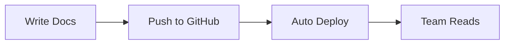

# Quick Start for Teams

Get Clarity configured and deployed for your team in just a few minutes.

## Step 1: Install Dependencies

```bash
pnpm install
```

## Step 2: Configure Your Site

Edit `clarity.config.ts` at the root of your project:

```typescript
export const clarityConfig = {
  site: {
    name: "Your Team Docs",
    description: "Documentation for your team",
    url: "https://docs.yourcompany.com",
    logo: "/logo.svg",
  },
  
  github: {
    enabled: true,
    repo: "yourorg/yourrepo",
    branch: "main",
    docsPath: "src/content/docs",
  },
  
  footer: {
    copyright: `© ${new Date().getFullYear()} Your Company`,
    links: [
      { text: "Main Site", href: "https://yourcompany.com" },
      { text: "Support", href: "mailto:support@yourcompany.com" },
    ],
  },
};
```

## Step 3: Add Your Logo

Replace the logo in the `public` folder:

```bash
# Add your logo as SVG (recommended) or PNG
public/logo.svg
```

## Step 4: Start Development

```bash
pnpm dev
```

Visit http://localhost:4321 to see your site.

## Step 5: Create Documentation

Add markdown files to `src/content/docs/`:

```markdown
---
title: "Your First Doc"
description: "Getting started with our product"
order: 1
---

# Welcome!

Your content here...
```

### File Organization

Organize docs in folders:

```
src/content/docs/
├── introduction.md
├── getting-started.md
├── guides/
│   ├── basic-usage.md
│   └── advanced-features.md
└── api/
    ├── authentication.md
    └── endpoints.md
```

## Step 6: Test Search

Build the search index:

```bash
pnpm build
```

The search index is automatically generated during the build process.

## Step 7: Deploy

### Option A: Vercel (Recommended)

```bash
npm i -g vercel
vercel
```

### Option B: Netlify

```bash
npm i -g netlify-cli
netlify deploy --prod
```

### Option C: GitHub Pages

1. Update `astro.config.mjs`:

```javascript
export default defineConfig({
  site: 'https://yourorg.github.io',
  base: '/yourrepo',
  // ... rest of config
});
```

2. Push to GitHub
3. Enable GitHub Pages in repository settings

## Essential Features

### Search (⌘K / Ctrl+K)

Users can search your entire documentation instantly. The search modal appears with keyboard shortcuts.

### Edit on GitHub

Contributors can click "Edit this page on GitHub" to suggest changes via pull requests.

### Dark Mode

Automatic dark mode based on system preferences. Users can toggle manually with the theme button.

### Navigation

- **Breadcrumbs**: Shows current location
- **Sidebar**: Collapsible navigation tree
- **Prev/Next**: Navigate between docs
- **Table of Contents**: Quick jumps on the right

### Code Examples

All code blocks have copy buttons:

```javascript
console.log("Hover to see copy button");
```

## Team Workflow

### 1. Content Authors

Write documentation in markdown:
- Use clear titles and descriptions
- Set `order` field for navigation
- Use `draft: true` for work-in-progress

### 2. Reviewers

Review via pull requests:
- GitHub integration shows edit links
- Preview changes before merging

### 3. Administrators

Configure via `clarity.config.ts`:
- Enable/disable features
- Update branding
- Manage footer links

## Customization Tips

### Disable Features You Don't Need

```typescript
features: {
  showBreadcrumbs: true,
  showLastUpdated: false,  // Disable if not tracking
  showContributors: false,  // Disable if not needed
  showPrevNext: true,
  copyCodeButton: true,
}
```

### Add Custom Styles

Edit `src/styles/global.css`:

```css
:root {
  --primary: 220 70% 50%;  /* Change primary color */
}
```

### Change Theme Colors

Use any Tailwind color:

```typescript
theme: {
  defaultMode: "system",
  primaryColor: "blue",  // or "green", "purple", etc.
}
```

## Mermaid Diagrams

Create diagrams with code:



## Common Tasks

### Add a New Section

1. Create folder: `src/content/docs/new-section/`
2. Add `index.md` with overview
3. Add additional pages with incrementing `order` values

### Update Site Name

```typescript
// clarity.config.ts
site: {
  name: "New Name",
}
```

### Add Footer Links

```typescript
// clarity.config.ts
footer: {
  links: [
    { text: "Privacy", href: "/privacy" },
    { text: "Terms", href: "/terms" },
  ],
}
```

### Track Last Updated

Add to any doc:

```markdown
---
title: "Page Title"
description: "Description"
lastUpdated: "2025-12-03"
contributors: ["Alice", "Bob"]
---
```

## Troubleshooting

### Search Not Working

Build the site first:
```bash
pnpm build
```

### Styles Not Loading

Clear cache and restart:
```bash
rm -rf .astro
pnpm dev
```

### Images Not Showing

Place images in `public/` folder:
```markdown

```

## Next Steps

- [Full Configuration Guide](../reference/configuration)
- [Writing Documentation Best Practices](../guides/best-practices)
- [Deployment Guide](../deployment/index)

## Support

- Check the [GitHub repository](https://github.com)
- Read the [full documentation](../introduction)
- Contact your team administrator

---

**Your team docs are ready!** 🎉
