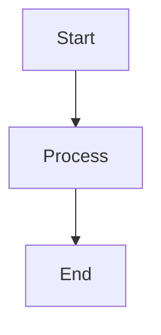

# Writing Documentation with Clarity

This guide covers best practices for writing documentation and using Clarity's markdown features effectively.

## Document Structure

### Frontmatter

Every documentation file should start with frontmatter:

```markdown
---
title: Your Page Title
description: A brief description for SEO
order: 10
draft: false
---
```

**Fields:**
- `title`: Page title (required)
- `description`: SEO meta description (required)
- `order`: Sidebar ordering (lower numbers appear first)
- `draft`: Set to `true` to hide in production
- `lastUpdated`: Automatically tracked (optional)
- `contributors`: Array of contributor names (optional)

## Markdown Basics

### Text Formatting

- **Bold text** for emphasis
- *Italic text* for subtle highlights
- ***Bold and italic*** for strong emphasis
- ~~Strikethrough~~ for deprecated content
- `Inline code` for technical terms and commands

### Links

- [External link](https://astro.build)
- [Internal link](../reference/configuration)
- [Link with title](https://github.com "GitHub")

### Code Blocks

Clarity supports syntax highlighting for multiple languages:

**JavaScript:**
```javascript
function greet(name) {
  console.log(`Hello, ${name}!`);
}

greet('Developer');
```

**TypeScript:**
```typescript
interface Config {
  name: string;
  version: number;
}

const config: Config = {
  name: 'Clarity',
  version: 1
};
```

**CSS:**
```css
.hero {
  background: linear-gradient(to right, #4f46e5, #06b6d4);
  color: white;
  padding: 2rem;
}
```

**Bash:**
```bash
pnpm install
pnpm dev
```

### Blockquotes

> "Documentation is a love letter that you write to your future self."
> — *Damian Conway*

Use blockquotes for important notes or quotes.

### Lists

**Unordered:**
- Item 1
- Item 2
  - Sub-item A
  - Sub-item B
- Item 3

**Ordered:**
1. First step
2. Second step
3. Third step

**Task Lists:**
- [x] Completed task
- [ ] Pending task
- [ ] Another pending task

## Tables

Create tables for structured information:

| Feature | Status | Description |
|---------|--------|-------------|
| Dark Mode | ✅ Ready | System preference detection |
| Search | ✅ Ready | Full-text with keyboard shortcuts |
| Auth | ✅ Ready | Google & GitHub OAuth |
| Responsive | ✅ Ready | Mobile-friendly design |

## Advanced Features

### Callouts

Use callouts (via components) for special notices:

```markdown
:::note
This is an informational callout.
:::

:::warning
This is a warning callout.
:::

:::danger
This is a danger callout.
:::
```

### Tabs

Create tabbed content for multiple options:

```markdown
:::tabs
== Tab 1
Content for tab 1

== Tab 2
Content for tab 2
:::
```

### Mermaid Diagrams

Clarity supports Mermaid for diagrams:



## Best Practices

### Writing Tips

1. **Be Concise**: Get to the point quickly
2. **Use Examples**: Code examples help understanding
3. **Add Context**: Explain why, not just how
4. **Stay Current**: Update docs with code changes
5. **Use Headings**: Break content into scannable sections

### SEO Optimization

- Write descriptive titles and descriptions
- Use proper heading hierarchy (H1 → H2 → H3)
- Include relevant keywords naturally
- Add alt text for images
- Link to related documentation

### Accessibility

- Use semantic headings
- Provide text alternatives for visual content
- Write descriptive link text (avoid "click here")
- Maintain good color contrast
- Keep paragraphs short and readable

## Navigation Features

### Table of Contents

The right sidebar automatically generates a table of contents from your headings. It:
- Updates as you scroll
- Highlights the current section
- Provides quick navigation

### Breadcrumbs

Breadcrumbs appear at the top of each page showing the document path.

### Previous/Next

Navigation links appear at the bottom to move between documents in order.

## Next Steps

- Learn about [Configuration](../reference/configuration)
- Explore [Using Components](../reference/components)
- Set up [Authentication](../getting-started/authentication)
- Deploy with the [Deployment Guide](../deployment/index)

Happy documenting!
