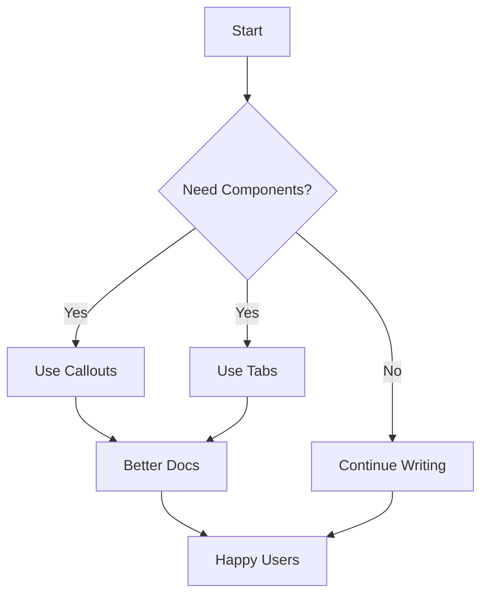

# Using Advanced Components

Clarity includes powerful components to make your documentation more engaging and interactive.

## Callouts

Use callouts to highlight important information:

### Info Callout
:::note
This is an informational callout. Great for general notes and tips.
:::

### Warning Callout
:::warning
This is a warning callout. Use it to alert users about potential issues.
:::

### Danger Callout
:::danger
This is a danger callout. Use for critical warnings that need immediate attention.
:::

### Success Callout
:::tip
This is a success/tip callout. Perfect for pro tips and best practices!
:::

## Tabs

Use tabs to show multiple code examples or options:

import Tabs from '../../../components/Tabs.astro';
import TabPanel from '../../../components/TabPanel.astro';

<Tabs>
  <TabPanel label="JavaScript">
    ```javascript
    function greet(name) {
      console.log(`Hello, ${name}!`);
    }
    
    greet('World');
    ```
  </TabPanel>
  <TabPanel label="TypeScript">
    ```typescript
    function greet(name: string): void {
      console.log(`Hello, ${name}!`);
    }
    
    greet('World');
    ```
  </TabPanel>
  <TabPanel label="Python">
    ```python
    def greet(name):
        print(f"Hello, {name}!")
    
    greet("World")
    ```
  </TabPanel>
</Tabs>

## Code Blocks with Copy

All code blocks automatically get a copy button on hover:

```bash
# Clone the repository
git clone https://github.com/yourorg/yourrepo.git
cd yourrepo

# Install dependencies
pnpm install

# Start development server
pnpm dev
```

## Mermaid Diagrams

Create flowcharts and diagrams:



## Combining Components

You can combine components for powerful documentation:

:::tip Custom Title
**Pro Tip:** You can nest components!

<Tabs>
  <TabPanel label="Installation">
    ```bash
    pnpm add clarity-components
    ```
  </TabPanel>
  <TabPanel label="Usage">
    ```typescript
    import { Callout } from 'clarity-components';
    ```
  </TabPanel>
</Tabs>
:::

## Next Steps

- Explore the [Configuration Guide](./configuration)
- Check out [Quick Start](./quick-start)
- Learn about [Team Features](./introduction)
